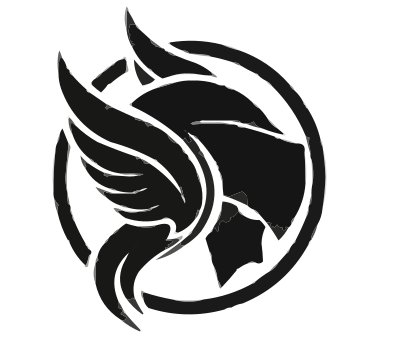

### Valkyria

An XML-configurable HTTP server in C++ with a focus on simplicity and customization.  
[**Explore the docs »**](https://github.com/valkyria-dev/valkyria)  
  
[View Demo](https://github.com/valkyria-dev/valkyria) · [Report Bug](https://github.com/valkyria-dev/valkyria/issues) · [Request Feature](https://github.com/valkyria-dev/valkyria/issues)

Table of Contents

1.  [About The Project](#about-the-project)
    *   [Built With](#built-with)
2.  [Getting Started](#getting-started)
    *   [Prerequisites](#prerequisites)
    *   [Installation](#installation)
3.  [Usage](#usage)
4.  [Roadmap](#roadmap)
5.  [Contributing](#contributing)
6.  [License](#license)
7.  [Contact](#contact)
8.  [Acknowledgments](#acknowledgments)

About The Project
-----------------

Valkyria is a simple HTTP server written in C++ that allows you to configure routes and settings using XML files. The server is designed with simplicity and ease of customization in mind. You can define routes, ports, root paths, and more without touching the C++ code.

Of course, this project is a starting point, and you are encouraged to modify it according to your needs.

### Built With

*   C++
*   XML Configuration

Getting Started
---------------

### Prerequisites

*   C++ Compiler
*   Git

### Installation

1.  Clone the repo
    
        git clone https://github.com/valkyria-dev/valkyria.git
        cd valkyria
    
2.  Build the server
    
        make
    
3.  Run the server
    
        ./server
    

Usage
-----

Valkyria is configured using XML files. Below is an example XML configuration (`config.xml`):

    <config>
        <port>3025</port>
        <rootPath>/var/www/html</rootPath>
        <interactiveMode>true</interactiveMode>
        <routes>
            <route path="/" content="<h1>Welcome to the homepage</h1>" />
            <route path="/about" content="<h1>About Us</h1>" />
        </routes>
    </config>

This example configures the server to listen on port 3025, set the root path to `/var/www/html`, enable interactive mode, and define two routes ("/" and "/about").

To run the server with this configuration:

    ./server config.xml

Roadmap
-------

*   XML-based configuration
*   Basic routing functionality
*   SSL/TLS support
*   Improved error handling
*   Support for additional HTTP methods
*   Multi-threading support

See the [open issues](https://github.com/valkyria-dev/valkyria/issues) for a full list of proposed features and enhancements.

Contributing
------------

Contributions are welcome! If you have suggestions, bug reports, or want to contribute code, please follow these steps:

1.  Fork the Project
2.  Create your Feature Branch (`git checkout -b feature/AmazingFeature`)
3.  Commit your Changes (`git commit -m 'Add some AmazingFeature'`)
4.  Push to the Branch (`git push origin feature/AmazingFeature`)
5.  Open a Pull Request

License
-------

Distributed under the MIT License. See `LICENSE` for more information.

Contact
-------

Valkyria Team - valkyria@example.com

Project Link: [https://github.com/valkyria-dev/valkyria](https://github.com/valkyria-dev/valkyria)

Acknowledgments
---------------

Use this space to list resources you find helpful and would like to give credit to. I've included a few of my favorites to kick things off!

*   [Choose an Open Source License](https://choosealicense.com)
*   [GitHub Emoji Cheat Sheet](https://www.webpagefx.com/tools/emoji-cheat-sheet)
*   [Malven's Flexbox Cheatsheet](https://flexbox.malven.co/)
*   [Malven's Grid Cheatsheet](https://grid.malven.co/)
*   [Img Shields](https://shields.io)
*   [GitHub Pages](https://pages.github.com)
*   [Font Awesome](https://fontawesome.com)
*   [React Icons](https://react-icons.github.io/react-icons/search)
